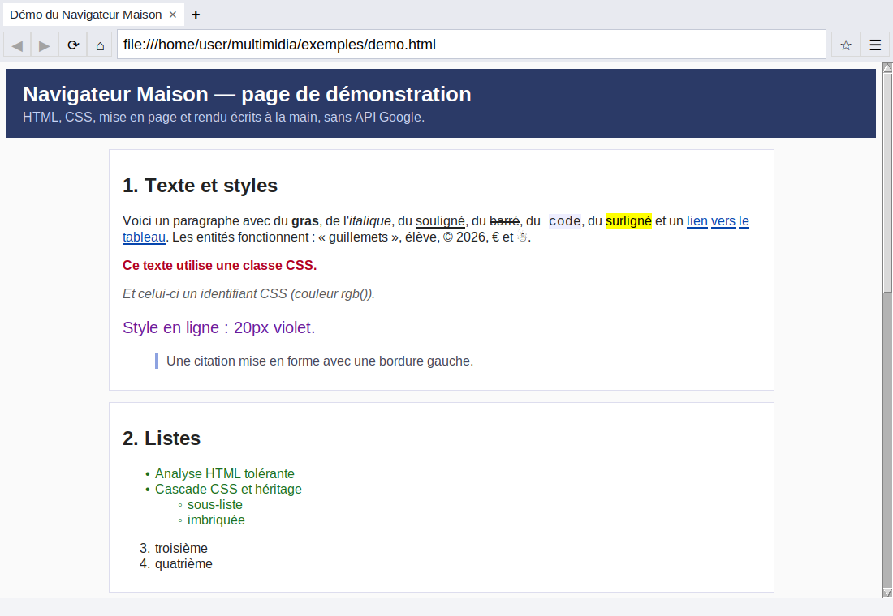

# Navigateur Maison

Un navigateur web **écrit entièrement à la main en Python**, sans aucune API Google
et sans moteur existant (ni Chromium, ni WebKit, ni Gecko).

Tout est développé dans le projet : connexion réseau HTTP/HTTPS, analyse du HTML,
moteur CSS, mise en page, rendu graphique et interface. On utilise seulement la
bibliothèque standard de Python : `socket` et `ssl` pour le réseau, `zlib` pour la
décompression gzip, et `tkinter` pour ouvrir une fenêtre et y dessiner.



## Lancer le navigateur

Il faut Python 3.8 ou plus récent, avec Tkinter (déjà inclus sous Windows et macOS).

```bash
# Linux (Debian/Ubuntu) : installer Tkinter si besoin
sudo apt install python3-tk

# Lancer le navigateur (page d'accueil)
python3 -m navigateur

# Ouvrir directement une adresse, un fichier local ou une recherche
python3 -m navigateur https://fr.wikipedia.org/wiki/Navigateur_web
python3 -m navigateur exemples/demo.html
python3 -m navigateur "cours de réseau"
```

Le fichier `exemples/demo.html` montre tout ce que le moteur sait afficher.

## Fonctionnalités

| Domaine | Ce qui est pris en charge |
|---|---|
| **Réseau** (`reseau.py`) | HTTP/1.1 et HTTPS (TLS), GET et POST, redirections (301/302/303/307/308), réponses « chunked », compression gzip/deflate, cookies, cache mémoire (`Cache-Control: max-age`), proxys HTTP (`CONNECT`), URL `file:`, `data:` et `about:` |
| **HTML** (`analyseur_html.py`) | Analyseur tolérant : `<html>`, `<head>` et `<body>` ajoutés s'ils manquent, fermetures implicites (`<p>`, `<li>`, `<td>`…), entités nommées et numériques, commentaires, `<script>` et `<style>` lus comme texte brut |
| **CSS** (`analyseur_css.py`) | Sélecteurs de balise, `.classe`, `#id`, `[attr=valeur]`, descendant, enfant `>`, frères `+` et `~`, `:first-child`, `:not()`… ; spécificité, `!important`, héritage, `@media`, `@import`, attribut `style`, raccourcis (`margin`, `padding`, `border`, `font`, `background`), couleurs (noms, `#hex`, `rgb()`, `hsl()`), unités (`px`, `em`, `rem`, `%`, `pt`, `calc()`…) |
| **Mise en page** (`mise_en_page.py`) | Boîtes de bloc (marges, bordures, remplissage, `width`, `max-width`, centrage avec `margin: auto`), texte avec retour à la ligne, `text-align`, `line-height`, `white-space: pre`, listes à puces et numérotées, tableaux (largeur des colonnes calculée, `colspan`), images PNG/GIF, champs de formulaire |
| **Interface** (`interface.py`) | Onglets, barre d'adresse (adresse ou recherche), précédent/suivant, recharger/arrêter, favoris, historique, zoom, recherche dans la page, code source, menu clic droit, chargement en arrière-plan (la fenêtre ne se bloque pas) |
| **Formulaires** | Champs texte et mot de passe, zones de texte, cases à cocher, boutons radio, listes déroulantes, envoi en GET ou POST |

Le moteur de recherche par défaut est **DuckDuckGo**, pas Google.

### Raccourcis clavier

| Touches | Action |
|---|---|
| `Ctrl+L` / `F6` | Aller à la barre d'adresse |
| `Ctrl+T` / `Ctrl+W` | Ouvrir / fermer un onglet |
| `Ctrl+Tab` | Onglet suivant |
| `Alt+←` / `Alt+→` | Précédent / suivant |
| `F5` / `Ctrl+R` | Recharger |
| `Ctrl+D` | Ajouter aux favoris (ou retirer) |
| `Ctrl+H` | Historique |
| `Ctrl+F` | Rechercher dans la page |
| `Ctrl+U` | Code source |
| `Ctrl++` / `Ctrl+-` / `Ctrl+0` | Zoom |
| Clic milieu ou `Ctrl+clic` | Ouvrir le lien dans un nouvel onglet |

## Architecture

Une page passe par les mêmes étapes que dans un vrai navigateur :

```
 adresse ──► reseau.py ──► analyseur_html.py ──► analyseur_css.py ──► mise_en_page.py ──► interface.py
            (octets)        (arbre DOM)          (styles calculés)    (boîtes, puis       (dessin sur un
                                                                       commandes de        canevas Tkinter)
                                                                       dessin)
```

| Fichier | Rôle |
|---|---|
| `navigateur/reseau.py` | URL, client HTTP/HTTPS écrit sur les sockets, cookies, cache |
| `navigateur/analyseur_html.py` | Découpage du HTML en jetons et construction de l'arbre DOM |
| `navigateur/analyseur_css.py` | Feuille de style par défaut, analyse CSS, sélecteurs, cascade, héritage |
| `navigateur/mise_en_page.py` | Calcul de la position de chaque boîte, puis liste de commandes de dessin |
| `navigateur/chargeur.py` | Charge une page complète : document, feuilles CSS et images |
| `navigateur/interface.py` | Fenêtre, onglets, événements souris et clavier, dessin |
| `navigateur/pages_internes.py` | Pages `about:accueil`, `about:historique`, `about:favoris`, `about:aide`, pages d'erreur |
| `navigateur/stockage.py` | Enregistrement de l'historique et des favoris (JSON dans `~/.navigateur_maison/`) |

La mise en page ne dépend pas de Tkinter : elle reçoit un objet qui mesure le texte.
Grâce à ça, on peut la tester sans écran (avec une police factice dans les tests).

## Tests

```bash
python3 -m unittest discover -s tests -v
```

Les 34 tests vérifient les URL, le protocole HTTP (sur un petit serveur local :
redirections, chunked, gzip, cookies, POST), l'analyse HTML, la cascade CSS, la
mise en page (retour à la ligne, centrage, tableaux, listes, formulaires) et le
stockage. Ils n'ont besoin ni d'écran ni d'Internet.

## Limites connues

- **JavaScript n'est pas exécuté.** Les pages s'affichent comme dans un navigateur où
  JavaScript est désactivé (le contenu de `<noscript>` est affiché). Écrire un
  interpréteur JavaScript serait un projet à part entière.
- **Images** : seuls PNG et GIF sont décodés (c'est ce que Tkinter sait afficher).
  Pour JPEG, WebP et SVG, on affiche le texte alternatif (`alt`).
- **CSS** : `float`, `flex`, `grid` et `position` sont affichés comme des blocs
  normaux. Les variables CSS (`var()`) sont ignorées.
- Les sites très modernes qui ont besoin de JavaScript pour s'afficher (applications
  web) ne fonctionneront pas. Les sites classiques (Wikipédia, documentation, blogs,
  pages HTML simples) s'affichent bien.
